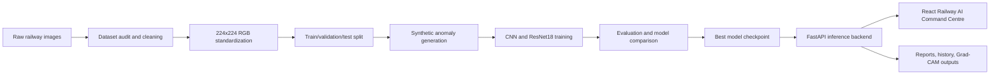
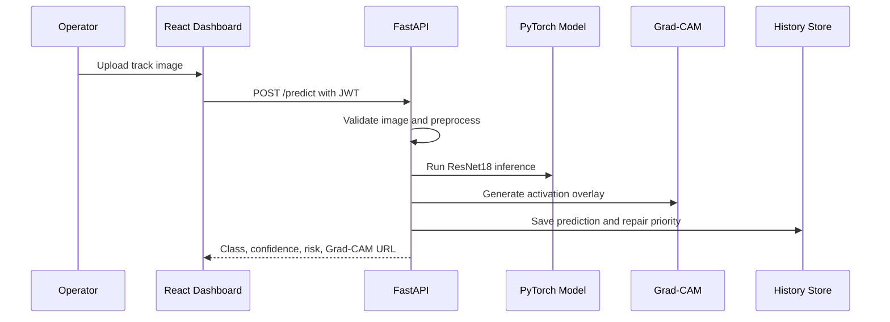

# Railway AI Railway Track Inspector

Enterprise-style computer vision system for railway track inspection. The project uses synthetic anomaly generation, supervised vision training, Grad-CAM explainability, a FastAPI inference backend, and a React command centre dashboard for real-time track health monitoring.

## Project Overview

The attached project abstract defines the system as a Generative AI and Computer Vision solution for safer, faster railway track inspection. The implementation focuses on four production-facing goals:

- Generate synthetic track anomalies to address scarce defect data.
- Train and compare a baseline CNN and transfer-learning ResNet18 model.
- Serve real-time image predictions with Grad-CAM explanations through FastAPI.
- Provide a professional dashboard for monitoring health, reports, model metadata, prediction history, and repair priority.

## Problem Statement

Manual railway inspection is slow, inconsistent, and limited by the availability of diverse defect examples. This system helps maintenance teams classify track anomalies, inspect model attention through Grad-CAM, review generated reports, and prioritize repair actions from uploaded track imagery.

## Project Abstract

Railway AI Railway Track Inspector is a Generative AI and Vision Model project for automated track inspection. It generates synthetic railway anomalies, trains robust computer vision models, processes track image data, monitors track health in a dashboard, and supports maintenance report generation and repair prioritization. Geospatial mapping and predictive degradation are represented as architecture-ready capabilities; live map coordinates are not fabricated when not supplied by the backend.

## System Architecture



## Prediction Pipeline



## Dataset Engineering Pipeline

- `scripts/pipeline.py` orchestrates dataset audit, cleaning, standardization, splitting, synthetic balancing, statistics, and markdown report generation.
- `dataset/raw` contains original class folders.
- `dataset/cleaned` stores valid deduplicated images.
- `dataset/processed` stores standardized 224x224 RGB JPEGs.
- `dataset/splits` stores train, validation, and test splits.
- Validation and test sets remain real-only to avoid synthetic data leakage.

## Computer Vision Pipeline

- Baseline CNN: custom PyTorch CNN with batch normalization, dropout, global average pooling, and classifier head.
- Transfer learning: ResNet18 with ImageNet weights, frozen-head warmup, then layer4 and fc fine-tuning.
- Normalization: ImageNet mean and standard deviation.
- Evaluation: accuracy, balanced accuracy, precision, recall, F1, confusion matrix, confidence distribution, per-class accuracy, and latency.
- Explainability: Grad-CAM overlays are generated for inference and evaluation galleries.

## Backend Architecture

FastAPI modules:

- `POST /login`: JWT authentication.
- `GET /health`: service, model, device, PyTorch, and GPU health.
- `GET /model/info`: model metadata and metrics from `models/model_metadata.json`.
- `POST /predict`: image validation, prediction, Grad-CAM generation, repair prioritization, and history logging.
- `GET /history`: prediction history.
- `GET /history/{prediction_id}`: single prediction detail.
- `DELETE /history`: clear history and generated Grad-CAM outputs.
- `GET /reports`: list generated reports from disk.
- `GET /reports/{filename}`: secure report download.

Security and operations:

- JWT bearer auth protects prediction, history, and report APIs.
- Upload validation enforces type and size limits.
- CORS origins are configured through `CORS_ALLOWED_ORIGINS`.
- Logs use rotating file handlers.
- History writes are atomic to reduce corruption risk.
- Swagger is available at `/docs`; ReDoc is available at `/redoc`.

## Frontend Architecture

React + TypeScript + Tailwind CSS v3 dashboard:

- Login with JWT session handling through Context API.
- Dashboard with backend health, model metadata, and history-derived metrics.
- Track Inspection upload workflow with prediction result, risk score, recommended action, and Grad-CAM compare viewer.
- Prediction History with filtering, sorting, detail modal, and Grad-CAM review.
- Reports page driven by backend report discovery.
- Model Information page driven by backend metadata.
- Health status in the navigation bar.
- Settings page for local history reset.
- Framer Motion animations and reusable dashboard components.

## Folder Structure

```text
Railway_AI_Training/
  backend/
    api/
    services/
    tests/
    utils/
    main.py
  dataset/
    raw/
    cleaned/
    processed/
    splits/
  documentation/
    architecture.md
  frontend/
    public/
    src/
      components/
      contexts/
      pages/
      services/
      types/
      utils/
  models/
  notebooks/
  reports/
  scripts/
  run.py
  requirements.txt
```

## Installation Guide

Backend:

```bash
python -m venv .venv
.venv\Scripts\activate
pip install -r requirements.txt
```

Frontend:

```bash
cd frontend
npm install
```

## Running Backend

```bash
python run.py
```

Backend starts at `http://127.0.0.1:8000`.

Recommended environment overrides:

```bash
set JWT_SECRET=replace-with-a-long-random-secret
set RAILWAY_DEMO_USER=admin
set RAILWAY_DEMO_PASSWORD=change-me
set CORS_ALLOWED_ORIGINS=http://localhost:5173,http://127.0.0.1:5173
```

## Running Frontend

```bash
cd frontend
npm run dev
```

Frontend starts at `http://localhost:5173`.

## Training and Evaluation

Dataset pipeline:

```bash
python -m scripts.pipeline
```

Training pipeline:

```bash
python -m scripts.train_pipeline
```

Evaluation only:

```bash
python -m scripts.evaluate
python -m scripts.compare
```

## Reports

Generated reports are served from `reports/`, including dataset report, training report, model comparison, metrics CSVs, classification report, and plot images.

## Screenshots

Add screenshots after running the frontend locally:

- Login screen
- Operations dashboard
- Track inspection result with Grad-CAM
- Prediction history detail
- Reports page
- Model information page

## Tech Stack

- Python, PyTorch, Torchvision, Pillow, NumPy, Pandas, Scikit-learn, Matplotlib
- FastAPI, Uvicorn, PyJWT
- React, TypeScript, Tailwind CSS v3, Framer Motion, Axios, React Router

## Project Workflow

1. Audit and clean raw track images.
2. Standardize image dimensions and channels.
3. Split real data into train, validation, and test sets.
4. Generate synthetic training anomalies only in the training split.
5. Train CNN and ResNet18.
6. Evaluate and compare models.
7. Export the best checkpoint and metadata.
8. Serve predictions and Grad-CAM through FastAPI.
9. Monitor inspections in the React command centre.

## Future Improvements

- Accept GPS/section metadata with predictions and render real geospatial anomaly maps.
- Add predictive degradation models when enough time-series inspection history exists.
- Replace demo credentials with an enterprise identity provider.
- Store history in PostgreSQL or SQLite for multi-user deployments.
- Add CI workflows for backend tests and frontend builds.

## Resume Highlights

- Built an end-to-end computer vision inspection platform with synthetic data generation.
- Implemented CNN and transfer-learning ResNet18 training and comparison.
- Integrated Grad-CAM explainability into real-time FastAPI predictions.
- Designed a React TypeScript dashboard with authentication, history, reports, and health monitoring.
- Added production-oriented logging, validation, error handling, and documentation.

## License

Educational and portfolio use. Add an explicit license file before public or commercial release.
