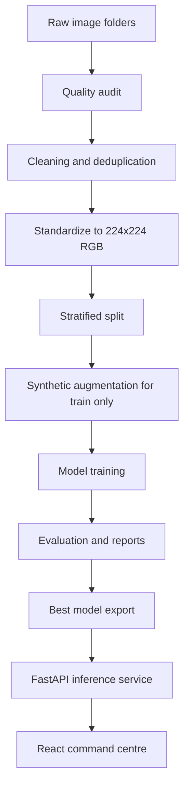
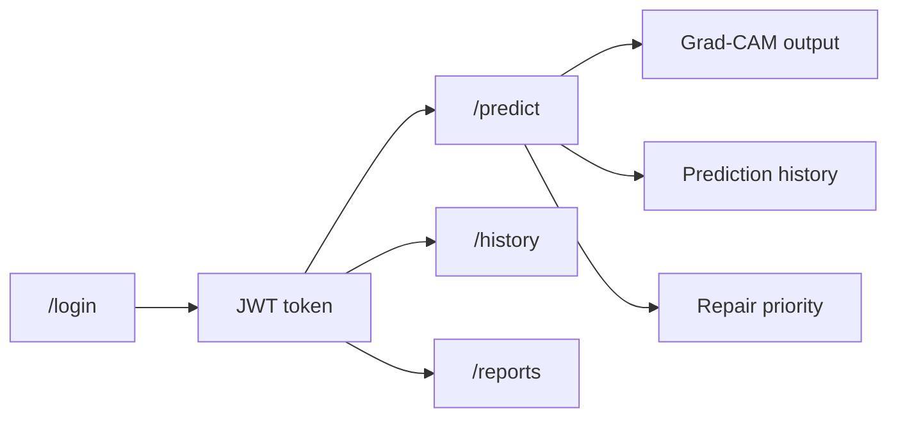

# Railway AI Track Inspector Architecture

## Requirement Mapping

| Abstract requirement | Implementation |
| --- | --- |
| Synthetic anomaly generation | `scripts/synthetic_generator.py`, `reports/augmentation_log.csv`, balanced training split |
| Computer vision model training | `scripts/train.py`, `scripts/train_pipeline.py`, CNN and ResNet18 checkpoints |
| Track data processing | `scripts/pipeline.py`, cleaner, standardizer, splitter, statistics report |
| Real-time track health monitoring | FastAPI health/model/history APIs and React dashboard |
| Automated repair prioritization | Backend prediction risk score, severity, and recommended action |
| Maintenance report generation | `reports/` artifacts and protected report download API |
| Grad-CAM explainability | `scripts/gradcam.py`, backend GradCAM service, frontend compare viewer |
| Geospatial anomaly mapping | Not faked. API records `location_status` until real coordinates are supplied. |
| Predictive degradation analysis | Architecture-ready future extension requiring historical time-series data. |

## Workflow Diagram

## API Flow

## Deployment Notes

- Keep model checkpoints in `models/`.
- Keep generated reports in `reports/`.
- Do not commit `node_modules`, `dist`, `__pycache__`, runtime logs, or transient backend outputs.
- Set `JWT_SECRET`, `RAILWAY_DEMO_USER`, `RAILWAY_DEMO_PASSWORD`, and `CORS_ALLOWED_ORIGINS` outside source control.
