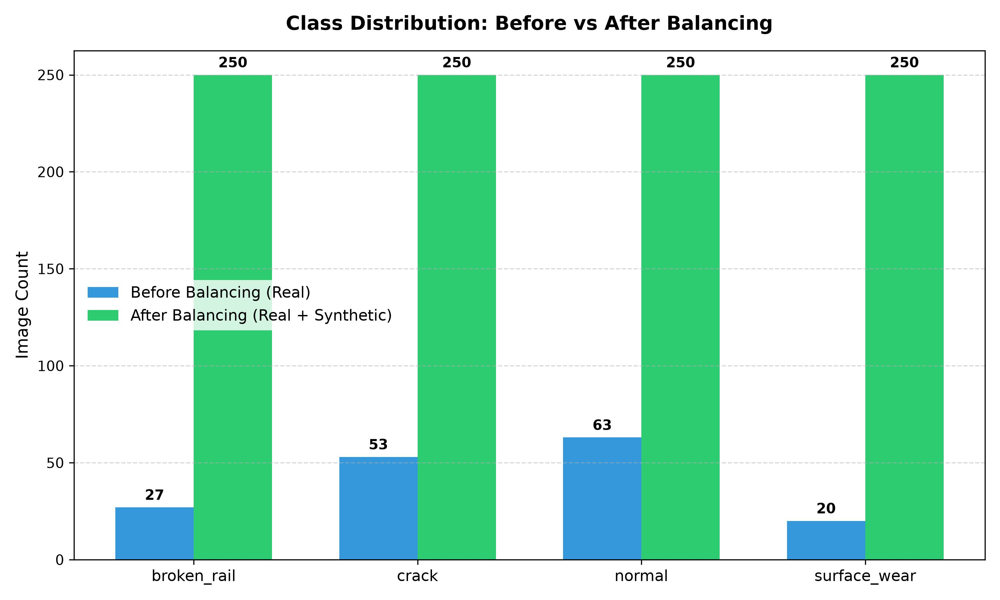
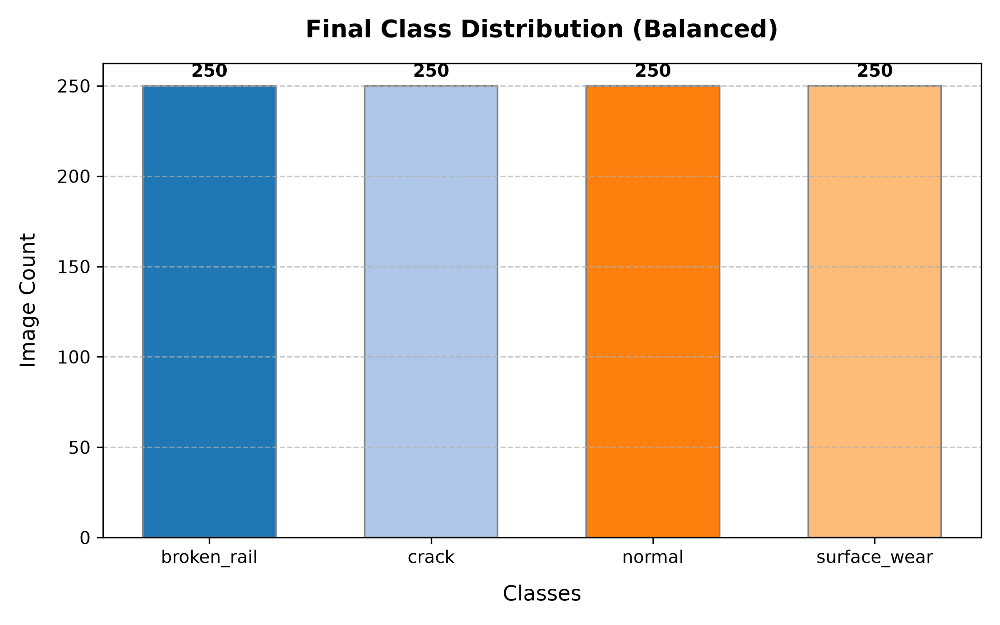

# Railway Track Inspection - Dataset Engineering Report

This report summarizes the data quality analysis, cleaning, standardisation, splitting, and balancing operations performed on the Railway Track Inspection dataset.

---

## 1. Executive Summary

- **Total Raw Images**: 163
- **Total Cleaned Images**: 146 (removed duplicates, corrupted, and invalid files)
- **Standardised Resolution**: 224 × 224 pixels
- **Standardised Format & Mode**: JPEG, RGB
- **Target Distribution**: ~250 images per class
- **Balanced Dataset Splits**:
  - **Train**: 115 real + 854 synthetic = 969 images
  - **Validation**: 13 images (100% real)
  - **Test**: 18 images (100% real)
- **Grand Total (Balanced Dataset)**: 1000 images

---

## 2. Dataset Quality Audit & Analysis (Step 1)

All raw images were inspected for format support, file integrity, blank colors, size thresholds, and uniqueness.

### File Format Scan
We detected the following formats in the raw folder:
- **JPEG/JPG**: 149 images
- **WEBP**: 11 images
- **AVIF**: 1 images
- **PNG**: 2 images

### Detected Issues
- **Corrupted/Unreadable Images**: 0
- **Unsupported Format Images**: 0
- **Extremely Small Images (<64px)**: 0
- **Blank/Flat-Color Images**: 0

---

## 3. Dataset Cleaning (Step 2)

To maintain a clean and reliable label distribution, we filtered out invalid files and resolved duplication. All cleaning actions were logged to `cleaning_log.csv`.

### Duplicate Analysis & Resolution
We calculated MD5 hashes of all images and resolved duplication as follows:
- **Intra-class Duplicates**: Kept the first occurrence, discarded the remaining identical files.
- **Cross-class Duplicates (Label Noise)**: Removed cross-class duplicate images entirely. Having identical images in multiple classes (e.g. `broken_rail` and `normal`) creates class ambiguity that degrades model training and evaluation. A total of **0** cross-class duplicate records were excluded.

### Summary of Exclusions
- **Duplicates Removed**: 0
- **Corrupted Files Removed**: 0
- **Total Excluded Files**: 17

All kept files were copied to `dataset/cleaned/` with normalized filenames (e.g., `normal_001.jpg`).

---

## 4. Image Standardisation (Step 3)

Cleaned images were standardized to a uniform shape and color profile ready for deep neural network input:
- **Color Mode**: Converted to 3-channel **RGB** (removing transparency/alpha channels).
- **Target Resolution**: **224 × 224 pixels**.
- **Aspect Ratio Conservation**: To prevent stretching/distortion, we resized images using the maximum bounding box and filled the empty borders using **black letterbox padding** `(0, 0, 0)`.
- **Output Format**: Saved as high-quality **JPEG** in `dataset/processed/`.

---

## 5. Dataset Splitting (Step 5)

We performed a **stratified** split of the standardized real images to maintain class proportions across partitions:
- **Train**: 80%
- **Validation**: 10%
- **Test**: 10%

> [!IMPORTANT]
> **Data Leakage Prevention**: Validation and test sets contain **ONLY real images**. Splitting was performed *before* generating synthetic data, ensuring that augmented versions of training images never leak into evaluation splits.

---

## 6. Class Balancing & Synthetic Data Generation (Step 4)

We analysed the size of each class in the training split and automatically generated the exact number of synthetic images needed to reach a total of **250** images per class (real + synthetic).

### Synthetic Generation Methodology
Synthetic images were generated inside `dataset/splits/train/[class]/` using two complementary approaches:
1. **Approach 1: Standard Augmentations**
   - Applies random geometric and color transforms: rotation (-15° to 15°), horizontal flips, brightness/contrast adjustments, gamma shifts, random crop/resize, Gaussian noise, perspective shears, blur, and histogram equalization.
2. **Approach 2: Controlled Railway Defect Simulation**
   - *Rust Texture*: Blends realistic brownish-red noise patches onto the tracks.
   - *Surface Wear*: Draws shiny metallic wheel contact bands in the center.
   - *Small Crack Extension*: Traces thin, dark, jagged paths representing micro-cracks.
   - *Weather Effects*: Simulates atmospheric variations (rain streaks, foggy mist).
   - *Lighting & Camera*: Adds localized shadow polygons, lens dust specs, and exposure variations.

### Generation Summary
- **Total Synthetic Images Generated**: 854
- **Breakdown of Approaches**:
  - Standard Augmentation: 313
  - Railway Defect Simulation: 279
  - Combined: 262

---

## 7. Dataset Statistics (Step 6)

### Distribution Breakdown Table
| Class Name | Raw (Real) | Cleaned (Real) | Train (Real) | Train (Synthetic) | Val (Real) | Test (Real) | Total Balanced |
| :--- | :---: | :---: | :---: | :---: | :---: | :---: | :---: |
| broken_rail | 27 | 22 | 17 | 228 | 2 | 3 | 250 |
| crack | 53 | 46 | 36 | 204 | 4 | 6 | 250 |
| normal | 63 | 60 | 48 | 190 | 6 | 6 | 250 |
| surface_wear | 20 | 18 | 14 | 232 | 1 | 3 | 250 |
| **Total** | **163** | **146** | **115** | **854** | **13** | **18** | **1000** |

### Class Distribution Visualizations

Before vs After Balancing Comparison:

Final Class Distribution (Balanced):

---
*Report generated automatically on 2026-06-25 by the Railway Track Inspection AI Foundation Pipeline.*
