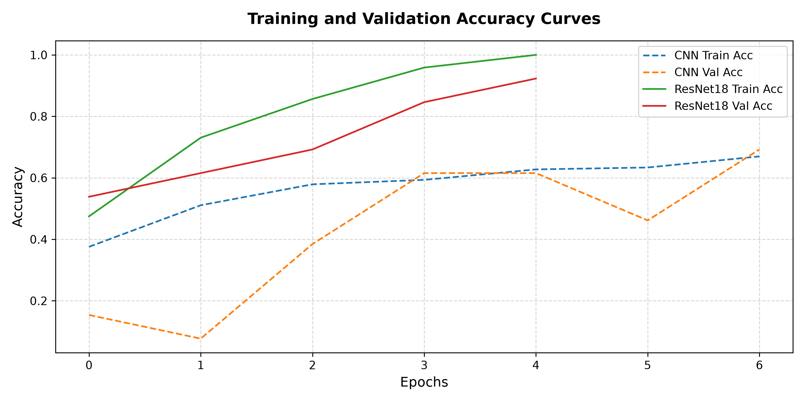
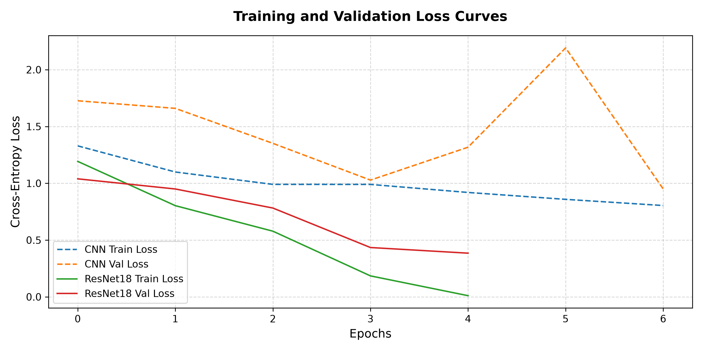

# Railway Track Inspection - Model Training Report

This report summarizes the training progression, learning dynamics, and hyperparameters for both the Baseline CNN and Transfer Learning ResNet18 models.

---

## 1. Hyperparameters & Settings

- **Maximum Epochs**: 30
- **Early Stopping Patience**: 7 epochs (monitored on Validation Loss)
- **Automatic Mixed Precision (AMP)**: Enabled (if GPU is available)
- **Out-of-Memory (OOM) Handler**: Configured (recovers from VRAM limits by falling back from batch size 32 to 16)
- **Random Seed**: 42 (all initializations, dataloader shuffles, and split splits are deterministic)
- **Optimiser**: AdamW with weight decay `1e-4`
- **Learning Rate Scheduler**: `ReduceLROnPlateau` (decays LR by 0.5 if Validation Loss plateaus for 3 epochs)

---

## 2. Baseline CNN Model Training

The custom CNN was trained from scratch. 
- **Trainable Parameters**: 446,180
- **Total Training Time**: 113.1 seconds
- **Best Validation Accuracy**: 69.23% (Epoch 7)
- **Best Validation Loss**: 0.9503

---

## 3. Transfer Learning ResNet18 Model Training

ResNet18 was trained using pre-trained ImageNet weights in two phases:
1. **Phase 1: Head Warmup (3 epochs)**: Backbone frozen, only the custom classification head was trained (learning rate `1e-3`).
2. **Phase 2: Fine-Tuning (remaining epochs)**: Residual block `layer4` and the classification head unfrozen (learning rate `1e-4`).

- **Trainable Parameters (Phase 2)**: 8,393,860
- **Total Training Time**: 119.8 seconds
- **Best Validation Accuracy**: 92.31% (Epoch 5)
- **Best Validation Loss**: 0.3847

---

## 4. Learning Progression Curves

### Accuracy Dynamics
The training and validation accuracy progression for both models is compared below:

### Loss Dynamics
The training and validation cross-entropy loss progression is shown below:

---
*Report generated automatically on 2026-06-25 by MLOps Deep Learning orchestrator.*
